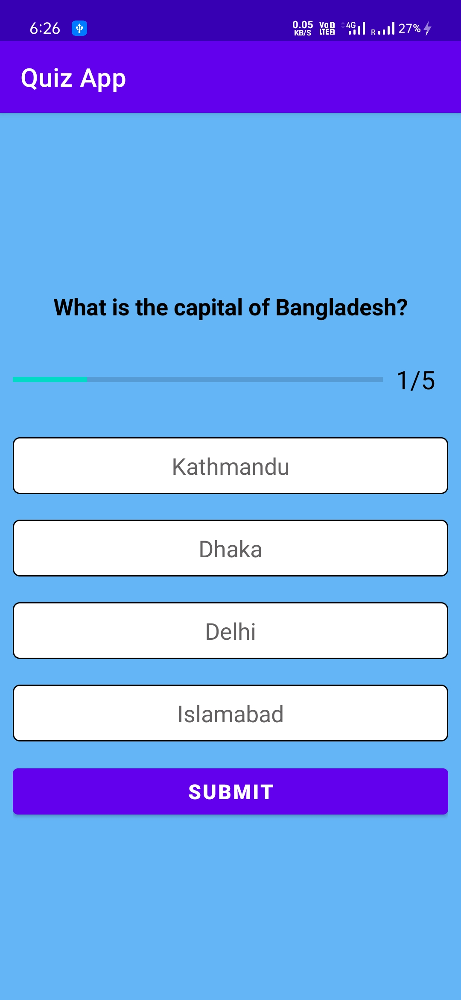
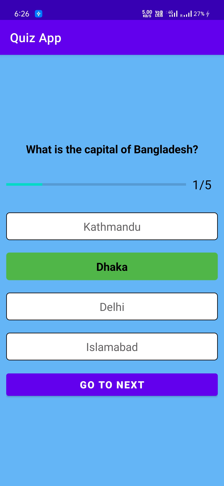
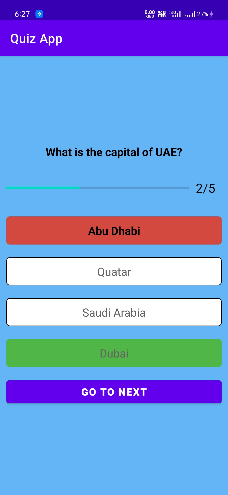
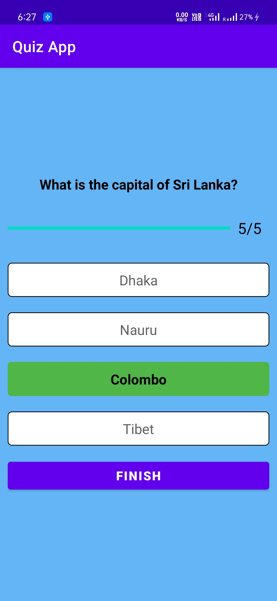

# Quiz App

A simple Quiz App that contains a set of curated questions and its answers and checks for the correctness of the answer given by the user and shows result at last.

### Show some ❤️ and star the repo to support the project

## 🛠 Skills
Kotlin, Android Studio....

## Screenshots

                                                            

## 🚀 About Me
- 👋 Hi, I’m @SandeepSaini9
- 👀 I’m interested in ...App Development
- 🌱 I’m currently learning ...Full Time Flutter Development
- 💞️ I’m looking to collaborate on ...Flutter Development
- 📫 How to reach me 
- Mail me at sandeepsaini74608@gmail.com
- www.linkedin.com/in/sandeep-saini-6a32801b3/

